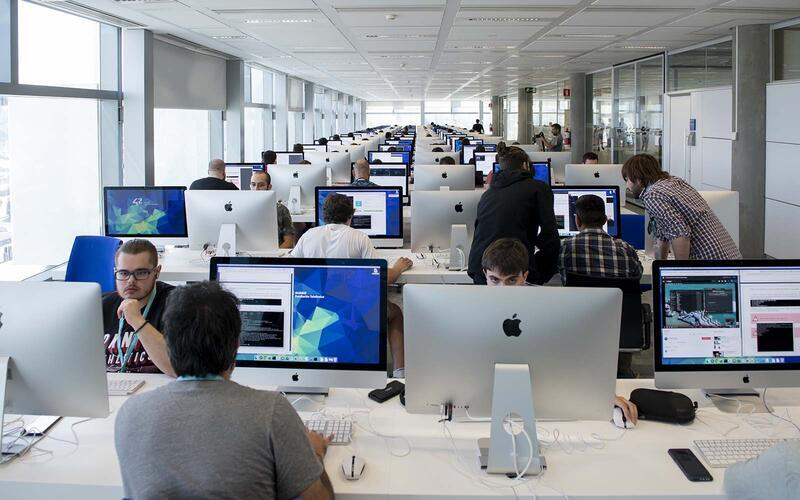

<h1 align="center"><b>My 42 Piscine Journey</b></h1>

  

 

## About

Welcome to my GitHub repository for my projects during the 42 Madrid C Piscine!

This repository contains all of the projects that I completed during my time at the 42 C Piscine, a rigorous 4-week coding bootcamp. Each project is contained within its own directory, and includes all of the source code, Makefiles, and any necessary resources.

The projects cover a wide range of topics, including basic algorithms, data structures, system calls, networking, and more. Each project has its own set of requirements and constraints, and I worked diligently to ensure that my code met all of these requirements and was as efficient as possible.

I am proud of the work that I have done during the 42 C Piscine, and I believe that this repository serves as a testament to my dedication and hard work. I hope that others will find value in my code, whether it be as a reference for their own projects or as a source of inspiration for their own coding journey.

Thank you for visiting my GitHub repository, and please feel free to reach out to me if you have any questions or feedback.

 

  

 

## Skills developed at C Piscine

### Hard-skills
	# C Language
		The primary language learned at the 42's Piscine is C: dealing with variables,
		pointers, memory allocation, macros, as well as creating functions and programs,
		including the use and creation of libraries and Makefiles.

	# Shell
		The first two days of the bootcamp are dedicated to learning basic to intermediate
		shell commands to seamlessly navigate through the terminal.

	# Git
		All projects are submitted via a remote git repository, which demands students to
		be at ease with such a system.

### Soft-skills
	# Self-learning and proactiveness
		At 42, self-learning is at the core of its peer to peer learning methodology. There
		are no teachers whatsoever; the learning process is based on googling, enquiring
		your classmates, and empirical knowledge, each student learning at their own pace.

	# Teamwork
		On weekends, a 48h team project called "Rush" is proposed: a 3-member group randomly
		chosen by the school's system must collaboratively develop a fully running application.
		The major challenge here is to equalize the different knowledge levels while finding a
		common work methodology that allows all team members to contribute to the project.

	# Time management and resiliency
		The school is open 24/7. Thus, the so-called "pisciners" are free to work whenever
		they want, which demands excellent time management skills and resiliency for not
		"drowning" amid the massive load of work demanded by the non-stop 26-day program.
		
 

## Projects

| Project               | Status |
|:---------------------:|--------|
| [Shell 00](./Shell00) | 100%   |
| [Shell 01](./Shell01) | 100%   |
| [C 00](./C_00)        | 100%   |
| [C 01](./C_01)        | 100%   |
| [C 02](./C_02)        | 100%   |
| [C 03](./C_03)        | 100%   |
| [c 04](./C_04)        | 57%    |
| [C 05](./C_05)        | 0%     |
| [C 06](./C_06)        | 100%   |

 

## Exams

| Exam N | Status |
|:------:|--------|
|   00   |   48%  |
|   01   |   48%  |
|   02   |   0%   |
|  Final |   60%  |

